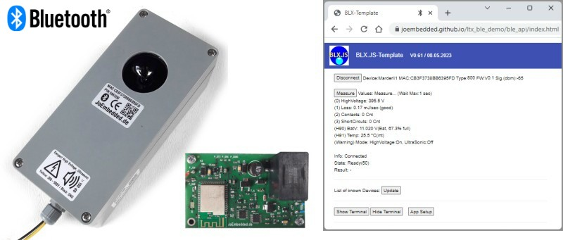

# OpenSensorBlue #
** OpenSensor Solution with BluetoothLE **

Ein Grossteil der Soft- und Hardware von Embedded Sensoren ist komplett uabhängig vom Endprodukt, beispielsweise das Power-Management,
Speicherzugriff, Kommunikation mit dem Benutzer, teilweise die Peripherie, ... 
Aus diesem Grund habe ich OpenSensorBlue entwickelt, ein OpenSource Framework für alle möglichen Arten von Sensoren, Datenloggern, Kleinsteuerungen, ... 

BluetoothLE (BLE) ist viel bequemer als Kabel und inzwischen funktioniert BLE im Browser (Android, PC und mit Einschränkungen auch iOS) sehr zuverlässig und nicht einmal eine APP wird dazu benötigt!

Die Software von OpenSensorBlue-Geräten kann von jedermann editiert, verändert, kompiliert und auf Hardware (vollständig dokumentiert) aufgespielt werden. Sämtliche benötigten
Quellcodes sind hier enthalten. Inklusive einer Bibliothek für die Kommunikation per BLE. Für professionellen Einsatz verfügt diese auch
auch über Sicherheitsmechanismen und Firmware-Over-the-Air-Updates (AES-verschlüsselt), aber für den Hobbygebrauch und während der Entwicklung ist dies eher lästig, 
es geht hier wesentlich einfacher und schneller, die Software gleich direkt per JTAG aufzuspielen oder zu debuggen.

Als Basis-CPU wird die NRF52832 eingesetzt, für die es eine Unzahl sehr preisgünstiger Module gibt. 

---
# Projekte #

## 0800_Marderli ##
Das erste 'Produkt' ist eine absolut profesionellee Marder-Scheuche mit Hochspannung und Ultraschall. 

Link: [Zum Projekt...](./documentation/0800_marder/README.md)

## ...weitere folgen.. ##

---
# Installation
- Built with SES (V6.22a (*)) and SDK 17.1.0   (*: Later Versions of SES require changed project settings!!!)
- Uses some JesFs (OpenSource) routines
- Set Global Macro $SDK_ROOT

---
## Tools ##

Link: [BLE API Live (im Repository)](https://joembedded.github.io/ltx_ble_demo/ble_api/index.html)

---
## Changelog  ##
- 15.07.2023 V1.0 

---

